<div align="center">

# 📦 LastMile Tracker

**A full-stack, zone-based last-mile delivery platform** — auto-calculated charges, smart agent assignment, immutable tracking history, and real-time customer notifications, built end-to-end with no hardcoded business rules.

[](#-tech-stack)
[](#-tech-stack)
[](#-tech-stack)
[](#-tech-stack)
[](#-tech-stack)

[**🚀 Live App**](https://lastmile-frontend-iaj4.onrender.com) · [**🔗 API**](https://lastmile-backend-bpts.onrender.com) · [System Design Write-up](./SYSTEM_DESIGN.md)

</div>

<br/>

<p align="center">
  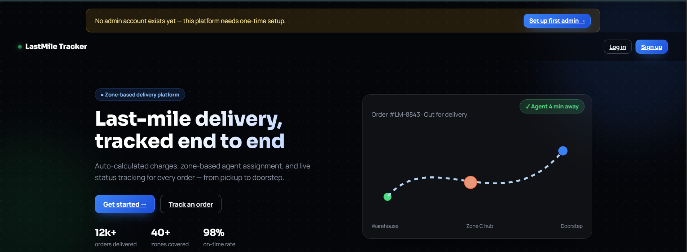
</p>

---

## 📖 Table of Contents

- [What this is](#-what-this-is)
- [Roles & Features](#-roles--features)
- [Architecture](#-architecture)
- [How a Charge Gets Calculated](#-how-a-charge-gets-calculated)
- [Order Status Lifecycle](#-order-status-lifecycle)
- [Product Walkthrough](#-product-walkthrough)
- [Tech Stack](#-tech-stack)
- [Project Structure](#-project-structure)
- [Getting Started](#-getting-started)
- [Environment Variables](#-environment-variables)
- [Database Schema](#-database-schema)
- [API Reference](#-api-reference)
- [Deployment](#-deployment)
- [Live Demo](#-live-demo)

---

## 🧭 What this is

Logistics platforms need three things to actually work in production: **pricing that isn't hardcoded**, **agent assignment that scales**, and **a tracking history nobody can quietly edit**. LastMile Tracker is built around exactly those three ideas.

There are three roles — **Customer**, **Delivery Agent**, and **Admin** — each with a dedicated dashboard behind JWT-based, role-scoped auth. Zones, rate cards, and COD surcharges are all configured live from the Admin dashboard, so pricing can change without a single deployment — and every order's journey from `Created` to `Delivered` (or `Failed` → `Rescheduled`) is logged as an append-only, immutable timeline.

---

## 👥 Roles & Features

<table>
<tr><td width="33%" valign="top">

### 🧑 Customer
- Register with email OTP, or sign in with Google
- Live charge preview before confirming
- Place orders — Prepaid or COD
- Full status timeline per order
- Request reschedule after a failed delivery
- Rate & review after delivery

</td><td width="33%" valign="top">

### 🚴 Delivery Agent
- Register with KYC (Aadhaar / License / PAN)
- Admin-approved before login is allowed
- View assigned deliveries
- Update status step-by-step
- Toggle own availability & zone

</td><td width="33%" valign="top">

### 🛠️ Admin
- Configure **zones**, **rate cards**, **COD surcharges**
- Create orders on a customer's behalf
- Filter, reassign, and override any order
- Approve/reject agent KYC
- Manage all users; add other admins

</td></tr>
</table>

---

## 🏗️ Architecture

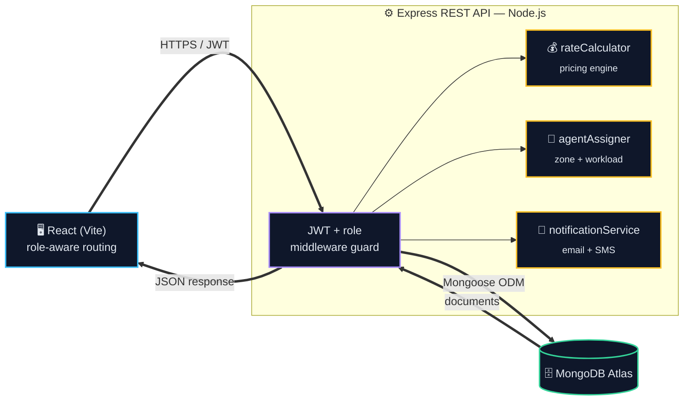

- **Frontend** — role-aware routing (`ProtectedRoute`), separate page trees per role, one Axios client per resource.
- **Backend** — layered `routes → controllers → utils/models`, every protected route behind JWT + role middleware.
- **rateCalculator & agentAssigner** — pure, reusable modules, not duplicated per controller — one source of truth each.
- **TrackingHistory** — append-only by schema design, not convention: Mongoose hooks block update/delete outright.

---

## 💰 How a Charge Gets Calculated

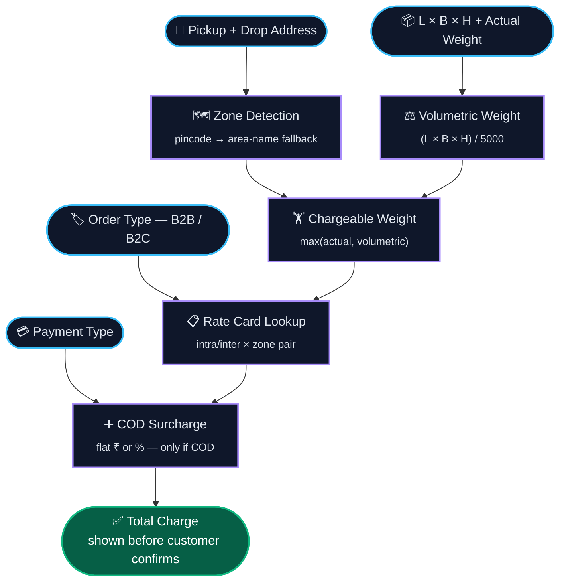

One function — `backend/src/utils/rateCalculator.js` — powers both the `/calculate-charge` preview and real order creation, so the price previewed is guaranteed to be the price charged. Nothing here is hardcoded: every rate, base fee, and surcharge is admin-configurable at runtime. Full reasoning in [`SYSTEM_DESIGN.md`](./SYSTEM_DESIGN.md#1-rate-calculation-engine).

---

## 🔄 Order Status Lifecycle

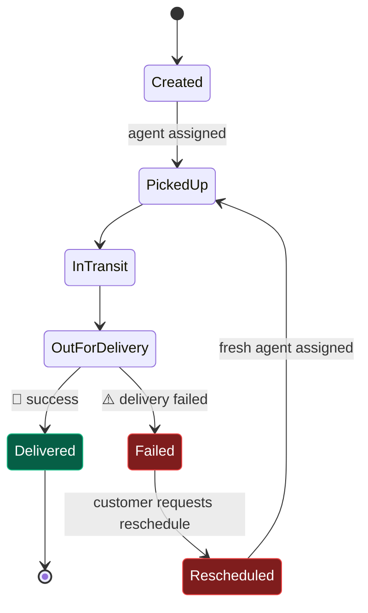

Enforced centrally in `backend/src/utils/statusTransitions.js` — every move is validated against this map, so an order can never jump straight from `Created` to `Delivered`. `Delivered` is the only true terminal state. **Every transition writes a new, immutable `TrackingHistory` entry** (status + actor + timestamp) and fires an email + SMS to the customer. Admins can bypass the map via an override-status endpoint for manual corrections. A rescheduled order re-enters at `PickedUp` and goes through the *exact same* tracked flow as a first attempt — full reasoning in [`SYSTEM_DESIGN.md`](./SYSTEM_DESIGN.md#4-failed-delivery--reschedule).

---

## 🖼️ Product Walkthrough

### 1️⃣ Sign Up & Onboarding

Every user starts here — pick a role, register, verify. Agents additionally submit KYC and wait for admin approval before they can log in.

<table>
<tr>
<td width="50%">

**Choose account type**
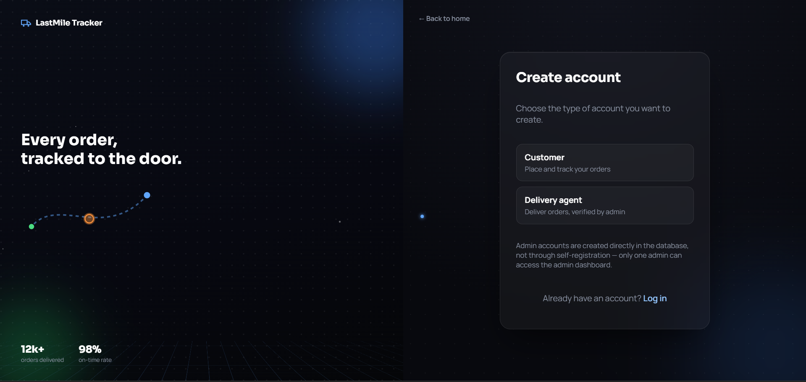
</td>
<td width="50%">

**Customer registration**
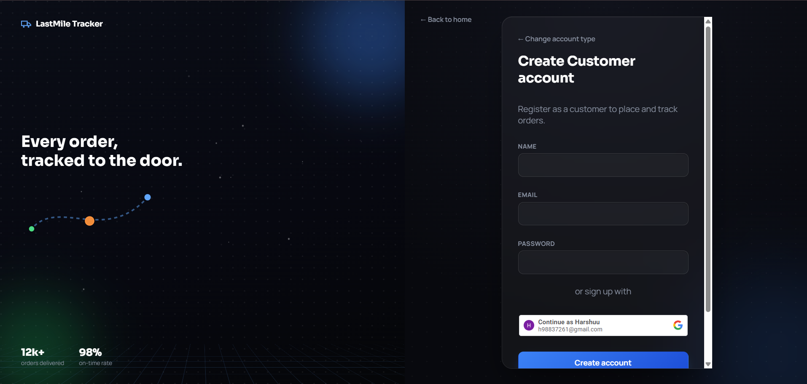
</td>
</tr>
<tr>
<td width="50%">

**Delivery agent KYC registration**

</td>
<td width="50%">

**Email OTP verification**
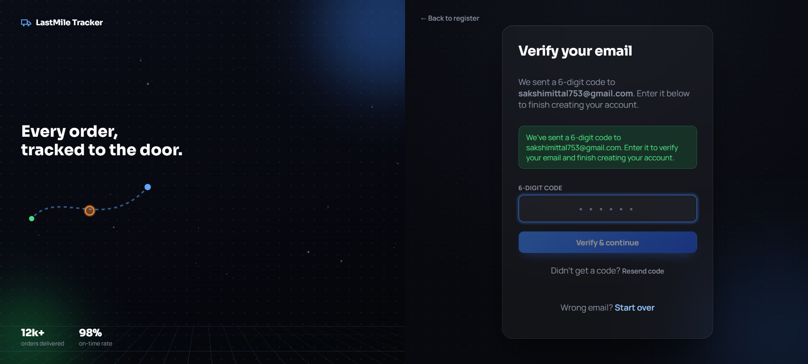
</td>
</tr>
</table>

### 2️⃣ Admin — Configuring the Business Rules

This is what makes the rate engine "no hardcoding" in practice: zones, pricing, and COD surcharges are all managed here, live.

<table>
<tr>
<td width="50%">

**Zones** — pincode + area coverage
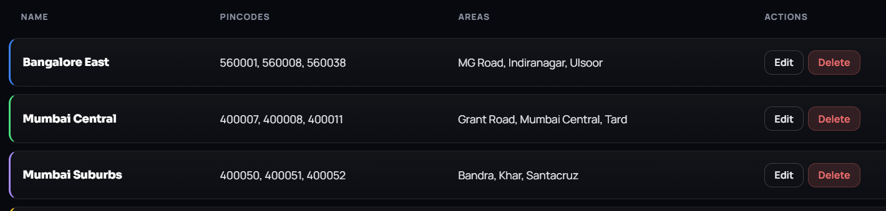
</td>
<td width="50%">

**Rate Cards** — B2B/B2C, intra/inter pricing
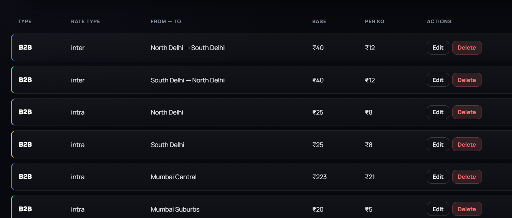
</td>
</tr>
<tr>
<td width="50%">

**COD Surcharge Config**
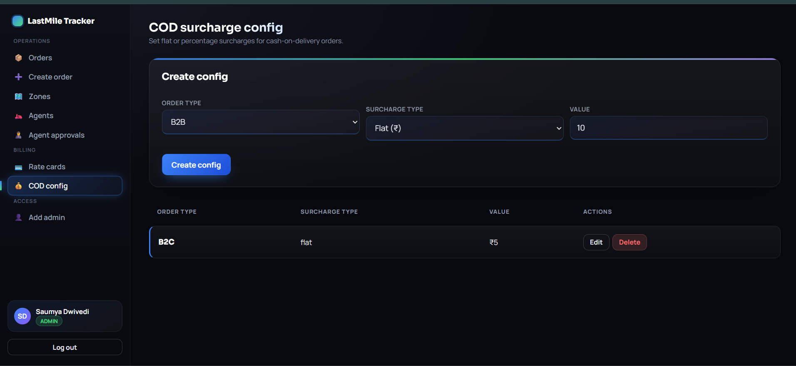
</td>
<td width="50%">

**Agent KYC Approvals** — always a manual decision

</td>
</tr>
</table>

### 3️⃣ Admin — Running Day-to-Day Operations

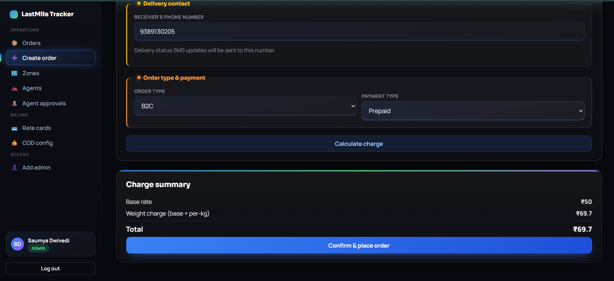
<p align="center"><em>Creating an order on a customer's behalf — the charge summary calculates live, before confirmation.</em></p>


<p align="center"><em>Every order in one control tower — filter by status/zone/agent, reassign, or override status directly.</em></p>

### 4️⃣ Delivery Agent


<p align="center"><em>Agents toggle their own availability and zone, and move each delivery through its status steps.</em></p>

### 5️⃣ Customer

<table>
<tr>
<td width="50%">

**Placing an order**

</td>
<td width="50%">

**Order history + post-delivery feedback**

</td>
</tr>
</table>

### 6️⃣ Notifications — Fired on Every Status Change

<table>
<tr>
<td width="50%">

**Email**
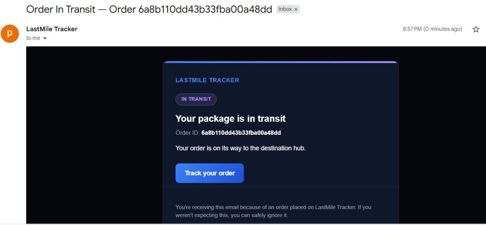
</td>
<td width="50%">

**SMS**
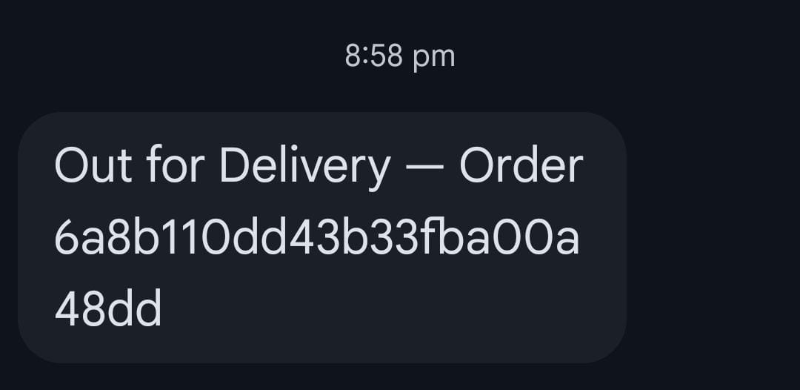
</td>
</tr>
</table>

---

## 🧰 Tech Stack

| Layer | Technology |
|---|---|
| Frontend | React 18 (Vite), React Router |
| Backend | Node.js, Express |
| Database | MongoDB + Mongoose |
| Auth | JWT, bcrypt, Google Identity Services (Google Sign-In) |
| Email | Nodemailer (Gmail API via OAuth2) |
| File uploads | Multer (agent KYC documents) |
| Hosting | Render (backend + frontend), MongoDB Atlas |

---

## 📁 Project Structure

```
last-mile-delivery-tracker/
├── backend/
│   ├── src/
│   │   ├── config/          # DB connection, mailer setup
│   │   ├── controllers/     # auth, orders, zones, rate cards, agents, tracking, feedback...
│   │   ├── middleware/      # JWT auth guard, role guard, file upload handling
│   │   ├── models/          # Mongoose schemas
│   │   ├── routes/          # Express routers
│   │   ├── templates/       # HTML email templates
│   │   ├── utils/           # rateCalculator, agentAssigner, statusTransitions, otp/notification services
│   │   ├── app.js
│   │   └── server.js
│   ├── scripts/              # seedFirstAdmin.js, migration helpers
│   ├── .env.example
│   └── package.json
├── frontend/
│   ├── src/
│   │   ├── api/               # Axios clients (one per resource)
│   │   ├── components/        # Navbar, Timeline, ProtectedRoute, GoogleSignInButton...
│   │   ├── context/            # AuthContext (JWT + user state)
│   │   ├── pages/
│   │   │   ├── customer/       # Place order, my orders, order tracking
│   │   │   ├── agent/          # Agent dashboard
│   │   │   └── admin/          # Zones, rate cards, agents, orders, users, COD config
│   │   ├── App.jsx
│   │   └── main.jsx
│   ├── .env.example
│   └── package.json
├── docs/screenshots/          # README assets
├── SYSTEM_DESIGN.md
├── DEPLOYMENT.md
└── README.md
```

---

## 🚀 Getting Started

### Prerequisites
- Node.js 18+
- A MongoDB connection string (Atlas free tier works fine)
- A Google OAuth Client ID (only needed for Google Sign-In)
- A Gmail account with an OAuth2 app configured (for OTP / status emails)

### 1. Backend

```bash
cd backend
npm install
cp .env.example .env      # fill in your own values
npm run dev                # or: npm start
```

API runs on `http://localhost:5000` by default.

Seed the first admin account (there's no public admin signup):

```bash
node scripts/seedFirstAdmin.js
```

### 2. Frontend

```bash
cd frontend
npm install
cp .env.example .env      # fill in your own values
npm run dev
```

Frontend runs on `http://localhost:5173` and proxies `/api` calls to the backend locally (see `vite.config.js`).

---

## 🔐 Environment Variables

**`backend/.env`**

| Variable | Description |
|---|---|
| `PORT` | Port the API listens on |
| `MONGO_URI` | MongoDB connection string |
| `JWT_SECRET` | Secret used to sign auth tokens |
| `JWT_EXPIRE` | Token expiry (e.g. `7d`) |
| `GMAIL_API_CLIENT_ID` / `GMAIL_API_CLIENT_SECRET` / `GMAIL_API_REFRESH_TOKEN` / `GMAIL_API_SENDER_EMAIL` | Gmail OAuth2 credentials for OTP & status emails |
| `GOOGLE_CLIENT_ID` | OAuth Client ID to verify Google Sign-In tokens |
| `CLIENT_ORIGIN` | Deployed frontend URL, for CORS |

**`frontend/.env`**

| Variable | Description |
|---|---|
| `VITE_API_BASE_URL` | `/api` locally (proxied by Vite); full deployed backend URL + `/api` in production |
| `VITE_GOOGLE_CLIENT_ID` | Same Google Client ID as the backend — safe to expose publicly |

Full, commented templates live in `backend/.env.example` and `frontend/.env.example`.

---

## 🗄️ Database Schema

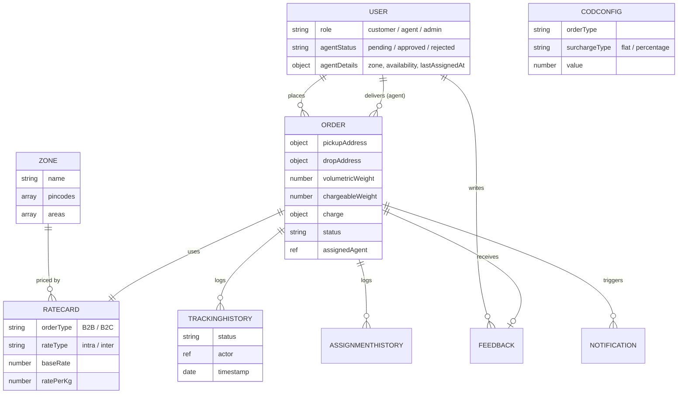

| Collection | Purpose |
|---|---|
| **User** | Customers, agents, and admins in one collection, distinguished by `role`. Agents additionally carry `agentStatus`, KYC document paths, and `agentDetails` (zone, availability, `lastAssignedAt` — used for fair auto-assignment). |
| **Zone** | A named service area, matched to orders via `pincodes` and/or `areas`. |
| **RateCard** | One row per `orderType` × `rateType` × zone pair, holding `baseRate` and `ratePerKg`. Unique-indexed to prevent duplicates. |
| **CODConfig** | One row per `orderType`, holding a `surchargeType` and `value`. |
| **Order** | The core record — addresses, dimensions, computed weights, `rateCardUsed`, full `charge` breakdown, `status`, `assignedAgent`, and a `reschedule` sub-document. |
| **TrackingHistory** | Append-only — one document per status change. Mongoose hooks block update/delete, enforcing immutability at the schema level. |
| **AssignmentHistory** | Log of agent assignment/reassignment events per order. |
| **Feedback** | Post-delivery customer rating + comment. |
| **Notification** | Record of notifications sent for an order. |

---

## 📡 API Reference

Base URL: `/api`. All routes except registration/login/first-admin-setup require a `Bearer` JWT.

<details>
<summary><strong>Auth — <code>/api/auth</code></strong></summary>

| Method | Route | Access | Description |
|---|---|---|---|
| POST | `/register` | Public | Register a customer or agent (agents submit KYC docs as multipart form data) |
| POST | `/verify-otp` | Public | Confirm the emailed OTP to activate an account |
| POST | `/resend-otp` | Public | Resend the OTP |
| POST | `/login` | Public | Customer/agent login |
| POST | `/admin-login` | Public | Admin login |
| POST | `/google` | Public | Google Sign-In (customer login/signup; admin only if account already exists) |
| GET | `/me` | Authenticated | Current user's profile |
| POST | `/forgot-password` | Public | Request a password reset email |
| POST | `/reset-password/:token` | Public | Reset password with emailed token |
| POST | `/create-admin` | Admin | Create another admin account |
| GET | `/customers` | Admin | List customers (used when admin creates an order on their behalf) |
| POST | `/setup-first-admin` | Public (one-time) | Bootstrap the very first admin account |
| GET | `/setup-first-admin/status` | Public | Check whether first-admin setup is still available |

</details>

<details>
<summary><strong>Zones — <code>/api/zones</code></strong></summary>

| Method | Route | Access | Description |
|---|---|---|---|
| POST | `/` | Admin | Create a zone |
| GET | `/` | Any logged-in user | List zones |
| GET | `/:id` | Any logged-in user | Get a zone |
| PUT | `/:id` | Admin | Update a zone |
| DELETE | `/:id` | Admin | Delete a zone |
| PATCH | `/:id/assign` | Admin | Add pincodes/areas to a zone |

</details>

<details>
<summary><strong>Rate Cards — <code>/api/rate-cards</code></strong> (Admin only)</summary>

| Method | Route | Description |
|---|---|---|
| GET | `/lookup` | Look up a rate card by orderType/rateType/zones |
| POST | `/` | Create a rate card |
| GET | `/` | List rate cards |
| GET / PUT / DELETE | `/:id` | Get / update / delete a rate card |

</details>

<details>
<summary><strong>COD Config — <code>/api/cod-config</code></strong> (Admin only)</summary>

| Method | Route | Description |
|---|---|---|
| GET | `/lookup/:orderType` | Look up the active COD config for a type |
| POST | `/` | Create a COD config |
| GET | `/` | List COD configs |
| GET / PUT / DELETE | `/:id` | Get / update / delete a COD config |

</details>

<details>
<summary><strong>Orders — <code>/api/orders</code></strong></summary>

| Method | Route | Access | Description |
|---|---|---|---|
| POST | `/calculate-charge` | Customer, Admin | Preview the charge for a not-yet-created order |
| POST | `/` | Customer, Admin | Create an order |
| GET | `/my` | Customer | Get the logged-in customer's own orders |
| GET | `/` | Admin | List all orders (filterable by status/zone/agent) |
| PATCH | `/:id/assign` | Admin | Manually assign an agent |
| PATCH | `/:id/auto-assign` | Admin | Auto-assign the best available agent |
| PATCH | `/:id/status` | Agent (own order), Admin | Move the order to the next valid status |
| PATCH | `/:id/override-status` | Admin | Force a status change, bypassing transition rules |
| GET | `/:id/tracking` | Owner (customer/agent/admin) | Full immutable tracking timeline |
| PATCH | `/:id/reschedule` | Customer | Request a reschedule on a Failed order |
| PATCH | `/:id/reschedule/reassign` | Admin | Reassign an agent after a reschedule |
| POST | `/:id/feedback` | Customer | Submit feedback after delivery |
| GET | `/:id/feedback` | Customer, Admin | Read feedback for an order |
| GET | `/:id` | Owner (customer/agent/admin) | Get one order |

</details>

<details>
<summary><strong>Agents — <code>/api/agents</code></strong></summary>

| Method | Route | Access | Description |
|---|---|---|---|
| PATCH | `/me/availability` | Agent | Toggle own availability |
| GET | `/me/orders` | Agent | Orders assigned to the logged-in agent |
| GET | `/pending` | Admin | List agents awaiting approval |
| PATCH | `/:id/approve` | Admin | Approve an agent |
| PATCH | `/:id/reject` | Admin | Reject an agent |
| GET | `/:id/documents/:docType` | Admin | Download a specific KYC document |
| GET | `/all` | Admin | Full agent roster |
| PATCH | `/:id/deactivate` | Admin | Deactivate an agent |
| PATCH | `/:id/reactivate` | Admin | Reactivate an agent |
| GET | `/:id/feedback` | Admin | Feedback summary for an agent |
| GET | `/` | Admin | Browse agents (e.g. for manual-assignment dropdown) |

</details>

---

## ☁️ Deployment

- **Backend** → Render (root directory `backend`; build: `npm install`; start: `npm start`)
- **Frontend** → Render Static Site (root directory `frontend`)
- **Database** → MongoDB Atlas (free tier)

See [`DEPLOYMENT.md`](./DEPLOYMENT.md) for the full step-by-step guide. Remember to set `CLIENT_ORIGIN` on the backend to your deployed frontend URL (for CORS), and `VITE_API_BASE_URL` on the frontend to your deployed backend URL + `/api`.

---

## 🌐 Live Demo

| | Link |
|---|---|
| **Frontend** | [lastmile-frontend-iaj4.onrender.com](https://lastmile-frontend-iaj4.onrender.com) |
| **Backend API** | [lastmile-backend-bpts.onrender.com](https://lastmile-backend-bpts.onrender.com) |

> ⏳ Hosted on Render's free tier — the backend spins down after inactivity, so the first request may take 30–60s to wake up. That's expected, not a bug.

