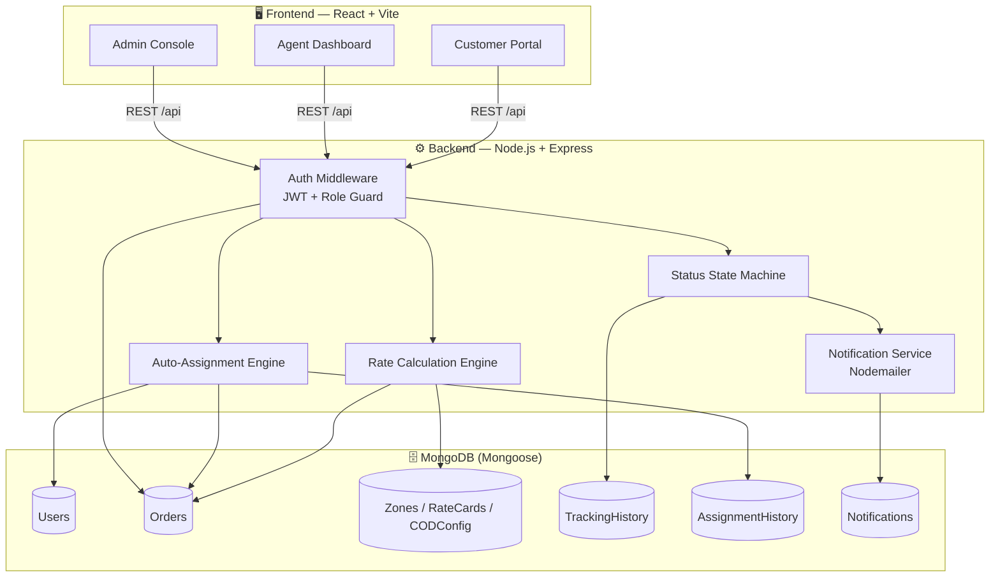
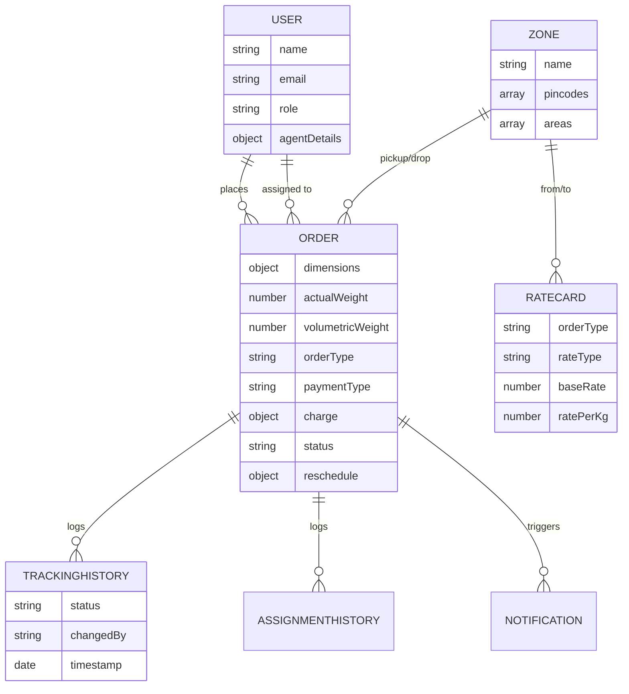

<div align="center">

# 🚚 Last-Mile Delivery Tracker

**A full-stack logistics platform with auto-calculated charges, intelligent agent assignment, and real-time delivery tracking.**

[](https://nodejs.org/)
[](https://expressjs.com/)
[](https://react.dev/)
[](https://vitejs.dev/)
[](https://www.mongodb.com/)
[](https://jwt.io/)
[](#-license)

[Live Demo](#-live-demo) · [Features](#-features) · [Architecture](#-architecture) · [Setup](#-quick-start) · [API Docs](#-api-reference) · [Screenshots](#-screenshots)

</div>

---

## 📖 Overview

**Last-Mile Delivery Tracker** is a role-based delivery management platform built for **customers**, **delivery agents**, and **admins**. Customers place orders and get an **auto-calculated shipping charge** before they even confirm — based on live, admin-configured rate cards, zone detection, and volumetric weight. Orders are then routed to the **nearest available agent** (manual or automatic), tracked through an **immutable status timeline**, and the customer is emailed at every step — including a full **reschedule flow** if a delivery fails.

Nothing about pricing or zones is hardcoded — admins configure zones, rate cards (B2B/B2C, intra/inter-zone), and COD surcharges entirely from the dashboard.

---

## ✨ Features

<table>
<tr>
<td width="33%" valign="top">

### 👤 Customer
- Register / login
- Place orders with live charge preview
- Track order on a full timeline
- Reschedule failed deliveries

</td>
<td width="33%" valign="top">

### 🛵 Delivery Agent
- View assigned orders
- Update delivery status
- Toggle availability
- Location / zone aware

</td>
<td width="33%" valign="top">

### 🛠️ Admin
- Manage zones & rate cards
- Configure COD surcharges
- Manual / auto agent assignment
- Filter, override, and audit all orders

</td>
</tr>
</table>

- ⚙️ **Rate engine** — zone detection → volumetric weight `(L×B×H)/5000` → chargeable weight (higher of actual vs. volumetric) → B2B/B2C rate card lookup → COD surcharge
- 🤖 **Auto-assignment** — nearest available agent by zone, load-balanced, round-robin tie-break
- 🔒 **Immutable tracking history** — every status change logged with timestamp + actor, nothing ever overwritten
- 🔁 **Failed delivery recovery** — customer reschedules → agent reassigned → re-enters normal lifecycle
- 📧 **Email notifications** on every status change (Nodemailer)
- 🔐 **Role-based JWT auth** — customer / agent / admin

---

## 🏗️ Architecture



**Request flow for a new order:**
`Customer submits order` → `Zone detection (pickup + drop)` → `Volumetric weight calc` → `Chargeable weight = max(actual, volumetric)` → `Rate card lookup (B2B/B2C × intra/inter)` → `COD surcharge applied` → `Charge previewed → confirmed` → `Order created` → `Auto/manual agent assignment` → `Status lifecycle + email on every change`

---

## 🖼️ Screenshots

> Add your UI screenshots below — drop the image files into a `docs/screenshots/` folder in the repo and update the paths.

<table>
<tr>
<td align="center" width="50%">

<br/><sub><b>Customer — Place Order & Live Charge Preview</b></sub>
</td>
<td align="center" width="50%">

<br/><sub><b>Customer — Order Tracking Timeline</b></sub>
</td>
</tr>
<tr>
<td align="center" width="50%">

<br/><sub><b>Delivery Agent — Assigned Orders</b></sub>
</td>
<td align="center" width="50%">

<br/><sub><b>Admin — Orders, Filters & Overrides</b></sub>
</td>
</tr>
<tr>
<td align="center" width="50%">

<br/><sub><b>Admin — Zones & Rate Card Configuration</b></sub>
</td>
<td align="center" width="50%">

<br/><sub><b>Admin — Zone Management</b></sub>
</td>
</tr>
</table>

---

## 🧰 Tech Stack

| Layer | Technology |
|---|---|
| Frontend | React 18 (Vite), React Router, Axios |
| Backend | Node.js, Express |
| Database | MongoDB + Mongoose |
| Auth | JWT, bcrypt, role-based middleware |
| Notifications | Nodemailer (SMTP) |
| File Uploads | Multer |

---

## 📁 Project Structure

```
last-mile-delivery-tracker/
├── backend/
│   ├── src/
│   │   ├── config/          # DB connection, env setup
│   │   ├── controllers/     # Route logic
│   │   ├── middleware/      # Auth guard, role checks
│   │   ├── models/          # User, Order, Zone, RateCard, CODConfig,
│   │   │                    # TrackingHistory, AssignmentHistory, Notification
│   │   ├── routes/          # authRoutes, orderRoutes, zoneRoutes, etc.
│   │   ├── templates/       # Email templates
│   │   └── utils/           # rateCalculator.js, agentAssigner.js,
│   │                        # statusTransitions.js
│   └── .env.example
├── frontend/
│   ├── src/
│   │   ├── api/             # Axios instance + API calls
│   │   ├── components/      # Shared UI components
│   │   ├── context/         # Auth context
│   │   └── pages/
│   │       ├── customer/    # PlaceOrder, MyOrders, OrderTracking
│   │       ├── agent/       # AgentDashboard
│   │       └── admin/       # AdminOrders, AdminZones, AdminRateCards, ...
│   └── .env.example
├── SYSTEM_DESIGN.md          # 800-word design write-up
├── DEPLOYMENT.md              # Render/Railway + Vercel hosting guide
└── README.md
```

---

## 🚀 Quick Start

### Prerequisites
- Node.js 18+
- MongoDB (local `mongod` or free [Atlas](https://www.mongodb.com/atlas) cluster)
- SMTP credentials for email (Mailtrap sandbox works great for local dev)

### 1️⃣ Backend

```bash
cd backend
npm install
cp .env.example .env      # fill in MONGO_URI, JWT_SECRET, SMTP_*
npm run dev                # → http://localhost:5000
```

### 2️⃣ Frontend

```bash
cd frontend
npm install
cp .env.example .env       # VITE_API_BASE_URL=/api works locally
npm run dev                 # → http://localhost:5173
```

Open `http://localhost:5173`, register as a customer or agent, and start placing orders. Admin accounts are created via `SetupFirstAdmin` / directly in MongoDB — see `.env.example` comments.

> 💡 Vite proxies `/api/*` to the backend in dev, so there's no CORS setup needed locally. For production hosting, see **[DEPLOYMENT.md](./DEPLOYMENT.md)**.

---

## 🔑 Environment Variables

<details>
<summary><b>Backend (<code>backend/.env.example</code>)</b></summary>

| Variable | Purpose |
|---|---|
| `PORT` | Express server port |
| `MONGO_URI` | MongoDB connection string |
| `JWT_SECRET` | Secret used to sign JWTs |
| `JWT_EXPIRES_IN` | Token expiry (e.g. `7d`) |
| `SMTP_PROVIDER` | `mailtrap` or `gmail` |
| `SMTP_HOST` / `SMTP_PORT` / `SMTP_SECURE` / `SMTP_USER` / `SMTP_PASS` | SMTP credentials |
| `SMTP_FROM` | From address on outgoing emails |
| `CLIENT_ORIGIN` | Deployed frontend URL, for CORS |

</details>

<details>
<summary><b>Frontend (<code>frontend/.env.example</code>)</b></summary>

| Variable | Purpose |
|---|---|
| `VITE_API_BASE_URL` | `/api` locally, full backend URL in production |

</details>

---

## 📡 API Reference

All routes are prefixed `/api`. Protected routes require `Authorization: Bearer <token>`.

<details>
<summary><b>Auth</b></summary>

| Method | Route | Access |
|---|---|---|
| POST | `/auth/register` | Public |
| POST | `/auth/login` | Public |
| GET | `/auth/me` | Auth |

</details>

<details>
<summary><b>Zones · Rate Cards · COD Config (admin-managed)</b></summary>

| Method | Route | Access |
|---|---|---|
| GET/POST/PUT/DELETE | `/zones` | Auth (read) / admin (write) |
| GET/POST/PUT/DELETE | `/ratecards` | Auth (read) / admin (write) |
| GET/POST/PUT/DELETE | `/codconfig` | Auth (read) / admin (write) |

</details>

<details>
<summary><b>Orders</b></summary>

| Method | Route | Access | Purpose |
|---|---|---|---|
| POST | `/orders/calculate-charge` | customer/admin | Preview charge before confirming |
| POST | `/orders` | customer/admin | Create order |
| GET | `/orders/mine` | customer | Own orders |
| GET | `/orders` | admin | All orders, filterable by status/zone/agent |
| GET | `/orders/:id/tracking` | owner/agent/admin | Full tracking timeline |
| PATCH | `/orders/:id/assign` | admin | Manually assign agent |
| PATCH | `/orders/:id/auto-assign` | admin | Auto-assign nearest agent |
| PATCH | `/orders/:id/status` | agent/admin | Update delivery status |
| PATCH | `/orders/:id/reschedule` | customer | Reschedule failed delivery |
| PATCH | `/orders/:id/reschedule/reassign` | admin | Reassign after reschedule |

</details>

<details>
<summary><b>Agents</b></summary>

| Method | Route | Access |
|---|---|---|
| GET | `/agents` | admin |
| GET | `/agents/me/orders` | agent |
| PATCH | `/agents/me/availability` | agent |

</details>

---

## 🗄️ Database Schema



---

## ⚙️ Rate Calculation Logic

Implemented in `backend/src/utils/rateCalculator.js` — fully admin-configurable, nothing hardcoded:

1. **Zone detection** — match pickup/drop pincode or area against each `Zone`'s `pincodes[]`/`areas[]`
2. **Volumetric weight** — `(Length × Breadth × Height) ÷ 5000`
3. **Chargeable weight** — higher of `actualWeight` vs. `volumetricWeight`
4. **Rate card lookup** — by `orderType` (B2B/B2C) + `intra`/`inter` zone → `baseRate + (chargeableWeight × ratePerKg)`
5. **COD surcharge** — flat or percentage, applied if `paymentType === 'COD'`
6. **Total** — previewed live via `POST /orders/calculate-charge`, then persisted on order creation

📄 Full design rationale (rate engine, zone detection, auto-assignment, failed-delivery handling) → **[SYSTEM_DESIGN.md](./SYSTEM_DESIGN.md)**

---

## ☁️ Deployment

- **Backend** → Render / Railway (root dir `backend`, `npm install` → `npm start`)
- **Frontend** → Vercel (root dir `frontend`)
- **Database** → MongoDB Atlas (free tier)

Full step-by-step guide → **[DEPLOYMENT.md](./DEPLOYMENT.md)**

## 🌐 Live Demo

| | Link |
|---|---|
| 🔗 Frontend | `<add your Vercel URL here>` |
| 🔗 Backend API | `<add your Render/Railway URL here>` |

---

## 📄 License

This project is submitted as part of an academic/assignment evaluation. All rights reserved by the author unless a license is added.

---

<div align="center">
<sub>Built with ❤️ using the MERN stack</sub>
</div>
