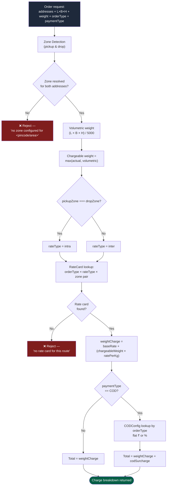
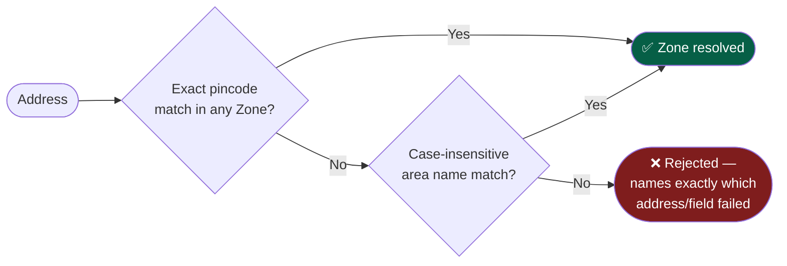
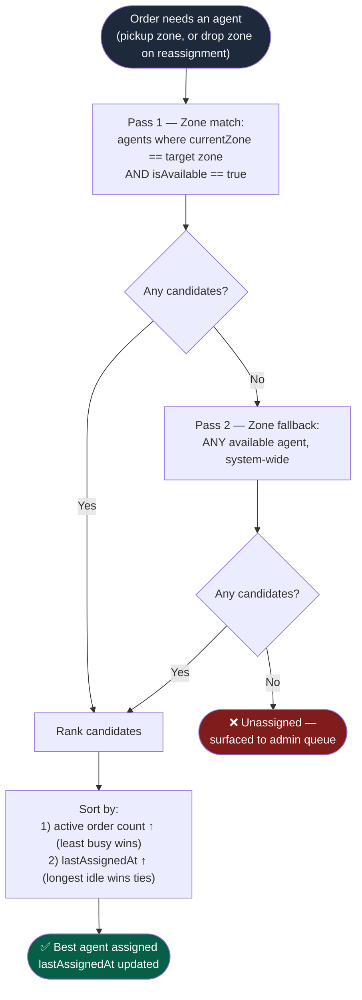
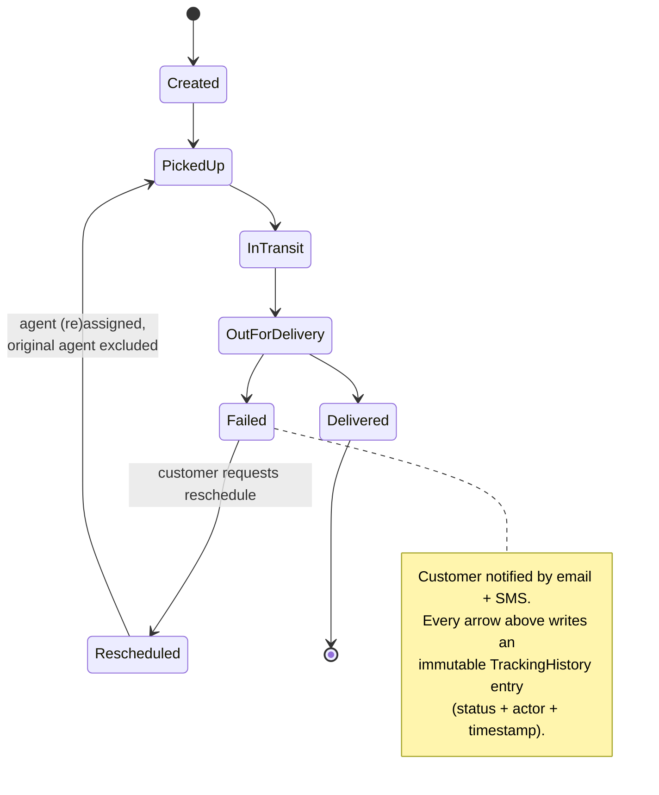

# System Design Write-Up

> The four things this project actually had to get right: **pricing that's never hardcoded**, **zone detection that doesn't break on messy addresses**, **agent assignment that stays fair as load grows**, and **a failure path that's tracked exactly as rigorously as the happy path**.

This is the "why it's built this way" companion to [`README.md`](./README.md) (which has the full API/schema reference). Four sub-systems, each with a diagram first and reasoning after.

## Table of Contents
- [1. Rate Calculation Engine](#1-rate-calculation-engine)
- [2. Zone Detection](#2-zone-detection)
- [3. Auto-Assignment Logic](#3-auto-assignment-logic)
- [4. Failed Delivery & Reschedule](#4-failed-delivery--reschedule)
- [Trade-offs, called out on purpose](#trade-offs-called-out-on-purpose)

---

## 1. Rate Calculation Engine

**The one rule that shapes everything else:** the price a customer previews and the price they're charged must come from the *same function call* — not two implementations that can quietly drift apart.

**Why this shape, specifically:**

- **One function, two callers.** `POST /calculate-charge` (the pre-confirm preview) and `POST /orders` (actual creation) both call `utils/rateCalculator.js`. If pricing logic lived in two places, they *would* eventually disagree — not a hypothetical, that's how most "quoted vs. billed" bugs happen in real checkout systems.
- **Volumetric-vs-actual, not just actual.** A large, light box (think a lampshade) still eats truck space proportional to its volume. Billing on actual weight alone systematically underprices bulky-but-light shipments — so the higher of the two always wins.
- **B2B and B2C are fully separate rate cards, not a discount multiplier on one card.** B2B shipments run bulkier volumes on thinner margins in practice; forcing them onto the same pricing curve as B2C would mean one segment always cross-subsidizes the other.
- **Fail loud, not silent.** A missing rate card or COD config throws a specific, named error instead of defaulting to ₹0 — an admin misconfiguration should surface immediately, not show up as a support ticket three weeks later.

---

## 2. Zone Detection

Real-world addresses are messy — pincodes get mistyped, some areas are configured by locality name instead. Zone detection needs a deterministic fallback chain, not a single brittle lookup.

**Why pincode-first, area-name-second:** pincodes are unambiguous — no spelling ambiguity, no locality naming disputes. Area names are the pragmatic fallback for addresses where the pincode is missing, wrong, or the admin simply prefers to configure a zone by neighborhood (`"Bandra, Khar, Santacruz"` reads a lot more intuitively in an ops dashboard than a pincode list). Supporting both means an admin can configure zones the way that matches *their* operations, instead of the system forcing one convention. A failed lookup names exactly what didn't resolve and for which address — so the fix is obvious, not a guessing game.

---

## 3. Auto-Assignment Logic

The question the assigner answers: *"who is the best available agent for this zone, right now?"* — done in three layered passes rather than one query, so an order is never stuck just because one zone is short-staffed.

**Design reasoning:**

- **Zone match is the "nearest agent" proxy — deliberately, not accidentally.** The schema already stores `agentDetails.currentLocation` (lat/lng) for a future haversine-distance ranking, but addresses in this project don't carry coordinates yet. Rather than fake precision with a half-built distance calculation, same-zone-first is used as an honest, documented stand-in. That's a scope boundary, not an oversight.
- **Two-pass search over a single query.** A strict "must be in-zone" filter would leave orders unassigned the moment one zone runs out of available agents — an operational failure mode a real ops team hits constantly during demand spikes. Falling back to system-wide availability trades a small "nearest" penalty for guaranteeing every order gets picked up.
- **Load-balance, then fairness.** Ranking by active order count first stops any one agent from getting buried; the `lastAssignedAt` tiebreaker stops the *same* least-busy agent from winning every tie in a slow period. Manual assignment (admin picks directly) and auto-assignment both read from the same live order-count, so the two paths can never disagree about who's "busy."

---

## 4. Failed Delivery & Reschedule

A rescheduled order isn't a special case bolted onto the side — it re-enters the exact same state machine, with the exact same tracking rigor, as a first attempt.

**Why it's built this way:**

- **`Failed` is reachable only from `OutForDelivery`.** The central transition map in `utils/statusTransitions.js` checks every update against this graph — an order can't be marked `Failed` from, say, `Created`, which would make no operational sense and would corrupt the timeline's meaning.
- **The failed agent is recorded and excluded, not just dropped.** On reschedule, the same three-pass assignment logic from section 3 runs again — minus the agent who already failed once on this order. Re-running the *same* algorithm (instead of a bespoke "reschedule assignment" path) means there's only one assignment policy in the codebase to reason about, ever.
- **Rescheduled orders re-enter at `PickedUp`, not a shortcut state.** This is the crux of "no special-cased shortcut": a rescheduled delivery gets pushed through `InTransit` → `OutForDelivery` → `Delivered` again with full tracking, because a second attempt succeeding is exactly as important to have on record as a first attempt succeeding — for the customer's trust and for the ops team's failure-rate metrics.
- **Immutability isn't a convention here, it's enforced.** `TrackingHistory` blocks update/delete at the Mongoose-hook level. So the full story — including the failure and the recovery — can't be quietly edited after the fact, by anyone.

---

## Trade-offs, called out on purpose

No system design is free of compromises — the ones worth naming explicitly:

| Decision | What was chosen | What was traded off |
|---|---|---|
| Nearest-agent proxy | Zone match instead of live geo-distance | Simplicity now; schema already supports adding real lat/lng ranking later without migration |
| Zone detection | Pincode → area-name fallback chain | No fuzzy/typo-tolerant matching — an admin must configure the exact pincode or area name |
| Rate cards | One row per exact zone pair | Doesn't auto-generalize (e.g. a "default inter-zone rate") — every route needs an explicit card, which is more setup but zero ambiguity |
| COD & rate config | Fully admin-editable, zero hardcoding | Slightly more setup screens for the admin, in exchange for zero-deployment pricing changes |
