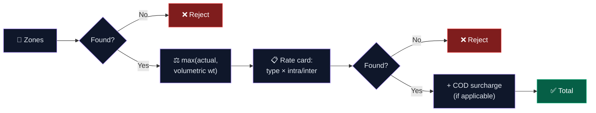
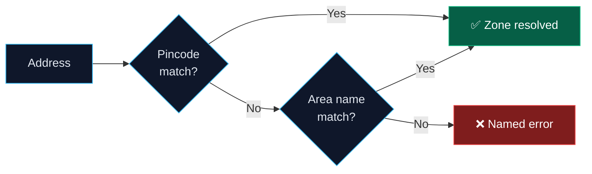
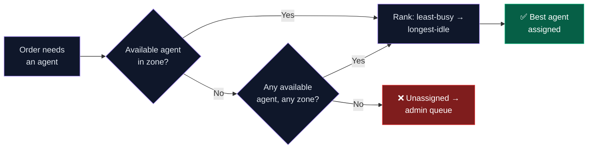
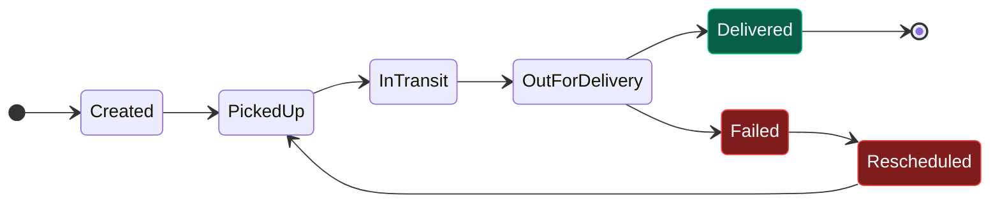

# System Design Write-Up

> The four things this project actually had to get right: **pricing that's never hardcoded**, **zone detection that doesn't break on messy addresses**, **agent assignment that stays fair as load grows**, and **a failure path that's tracked exactly as rigorously as the happy path**.

This is the "why it's built this way" companion to [`README.md`](./README.md) (full API/schema reference lives there). Each section below is a one-line summary + the reasoning — click **▶ Show diagram** to expand the visual for that piece.

## Table of Contents
- [1. Rate Calculation Engine](#1-rate-calculation-engine)
- [2. Zone Detection](#2-zone-detection)
- [3. Auto-Assignment Logic](#3-auto-assignment-logic)
- [4. Failed Delivery & Reschedule](#4-failed-delivery--reschedule)
- [Trade-offs, called out on purpose](#trade-offs-called-out-on-purpose)

---

## 1. Rate Calculation Engine

**In one line:** zone → volumetric-vs-actual weight → rate card lookup (B2B/B2C × intra/inter) → COD surcharge — one function, called by both the preview and the actual order, so quote and bill can never drift apart.

▶ Show diagram

**Why this shape:**
- **One function, two callers** (`calculate-charge` preview + `create order`) — no second implementation to drift out of sync.
- **Higher of actual vs. volumetric weight** — a large, light box still eats truck space; billing actual weight alone underprices it.
- **B2B and B2C are separate rate cards**, not a discount multiplier — B2B runs bulkier volumes on thinner margins in practice, so it needs independent pricing.
- **Fails loud** — a missing rate card/COD config throws a named error instead of silently defaulting to ₹0.

---

## 2. Zone Detection

**In one line:** exact pincode match first, case-insensitive area-name match as fallback, a named error if neither resolves.

▶ Show diagram

**Why:** pincodes are unambiguous; area names are the pragmatic fallback for addresses with a missing/wrong pincode, or zones an admin prefers to configure by neighborhood (`"Bandra, Khar, Santacruz"` reads better than a pincode list). Supporting both lets each admin configure zones the way that fits *their* ops, not a forced convention. A failed lookup names exactly what didn't resolve — not a generic error.

---

## 3. Auto-Assignment Logic

**In one line:** same-zone available agents first, system-wide available agents as fallback, then rank by least-busy → longest-idle.

▶ Show diagram

**Why:**
- **Zone match is an honest "nearest agent" proxy** — the schema already stores `agentDetails.currentLocation` for a future distance-based ranking, but addresses don't carry coordinates yet. This is a documented scope boundary, not an oversight.
- **Two passes, not one strict filter** — a zone-only search would leave orders unassigned the moment one zone runs short-staffed, a real failure mode during demand spikes.
- **Rank by load, then fairness** — least-busy wins first; `lastAssignedAt` breaks ties so the same agent doesn't win every tie in a slow period. Manual and auto-assignment read the same live order count, so the two paths never disagree about who's "busy."

---

## 4. Failed Delivery & Reschedule

**In one line:** `Failed` only fires from `OutForDelivery`; a reschedule re-runs the same assignment logic (excluding the failed agent) and re-enters the *exact same* tracked lifecycle — not a shortcut.

▶ Show diagram

**Why:**
- **`Failed` is reachable only from `OutForDelivery`** — the central transition map (`statusTransitions.js`) checks every update against this graph, so an order can't be marked `Failed` from a state where that makes no operational sense.
- **The failed agent is recorded and excluded**, not just dropped — the same section-3 assignment algorithm runs again, minus that one agent. One assignment policy in the codebase, always.
- **Reschedules re-enter at `PickedUp`**, not a shortcut state — a second attempt going through the full `InTransit → OutForDelivery → Delivered` sequence again matters just as much for customer trust and failure-rate metrics as a first attempt.
- **Immutability is enforced, not assumed** — `TrackingHistory` blocks update/delete at the Mongoose-hook level, so the failure-and-recovery story can't be quietly edited after the fact.

---

## Trade-offs, called out on purpose

| Decision | What was chosen | What was traded off |
|---|---|---|
| Nearest-agent proxy | Zone match instead of live geo-distance | Simple today; schema already supports real lat/lng ranking later, no migration needed |
| Zone detection | Pincode → area-name fallback chain | No fuzzy/typo-tolerant matching — admin must configure the exact pincode or area name |
| Rate cards | One row per exact zone pair | No auto-generalized "default" rate — every route needs an explicit card, more setup but zero ambiguity |
| COD & rate config | Fully admin-editable, zero hardcoding | More setup screens for the admin, in exchange for zero-deployment pricing changes |
